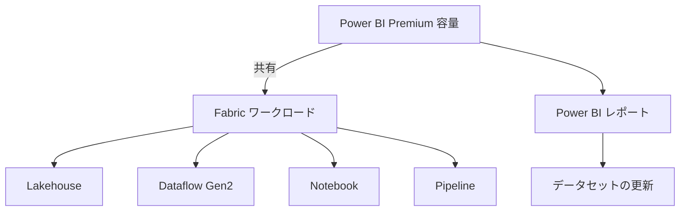

# Fabric の容量をどのように利用するとよいのか：効果的な活用と注意点

Microsoft Fabric は、データ統合から分析までを一貫して支援する統合プラットフォームであり、その中核となるのが「容量（Capacity）」の考え方です。容量は、パフォーマンスやコストに直結するため、適切な選定と運用が非常に重要です。本記事では、Fabric の容量をどのように活用すべきか、特に Power BI Premium 容量との関係や、スロットリング、コスト管理の観点から解説します。

---

## Power BI Premium 容量で Fabric を利用する際の注意点

Power BI Premium 容量でも Fabric の多くの機能を利用することが可能です。たとえば、Lakehouse、Dataflow Gen2、Notebook などのワークロードも Premium 容量で動作します。ただし、以下の点に注意が必要です：

- **リソースの競合**：Power BI レポートの更新やデータセットのリフレッシュと、Fabric の他のワークロード（例：Notebook や Pipeline）が同じ容量を共有するため、リソース競合が発生しやすくなります。
- **スロットリングのリスク**：Premium 容量は一定のリソース制限内で動作するため、過負荷時にはスロットリング（処理制限）が発生する可能性があります。特に、複数のワークロードが同時に動作する場合は注意が必要です。
- **ワークロードの優先順位設計**：Power BI のユーザー体験を損なわないように、どのワークロードを優先するかを設計段階で明確にしておくことが重要です。

---

## スロットリングを避けるための容量選定のポイント

Fabric では、各ワークロードに対して適切な容量を割り当てることが重要です。スロットリングが発生すると、処理が遅延したり、ジョブが失敗することもあります。以下の点を考慮して容量を選定しましょう：

- **用途別に容量を分ける**：たとえば、BI レポート用とデータエンジニアリング用で容量を分けることで、リソース競合を回避できます。
- **ピーク時の負荷を見積もる**：ユーザーのアクセスが集中する時間帯や、大規模なデータ処理が行われるタイミングを考慮して、余裕のある容量を選びましょう。
- **モニタリングの活用**：Fabric Capacity Metrics アプリなどを使って、リソース使用状況を定期的に確認し、必要に応じてスケールアップ／ダウンを検討します。

---

## コストを管理するためのコツ

Fabric の容量は、コストにも直結します。無駄な支出を避けるためには、以下のような工夫が有効です：

- **必要なときだけ容量を有効化**：一部の容量はオンデマンドで有効化できるため、常時稼働させる必要がないワークロードには適しています。
- **開発・検証環境は小規模容量で運用**：本番環境と分けて、開発やテストには小さな容量を使うことでコストを抑えられます。
- **自動スケーリングの活用**：将来的には、Fabric にも自動スケーリング機能が導入される可能性があります。現時点では手動対応が必要ですが、スクリプトや API を活用して柔軟に対応することも可能です。

---

## まとめ

Fabric の容量は、単なるリソースの割り当てではなく、パフォーマンスとコストのバランスを取るための重要な設計要素です。Power BI Premium 容量でも Fabric の機能を活用できますが、リソース競合やスロットリングのリスクを理解し、用途に応じた容量設計と運用を行うことが成功の鍵となります。容量設計は一度決めたら終わりではなく、定期的な見直しとモニタリングが重要です。まずは小さく始めて、必要に応じてスケールアップする運用を心がけましょう。
