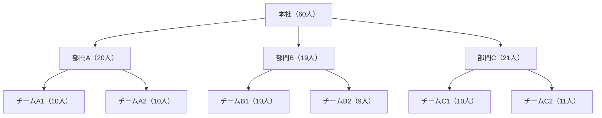
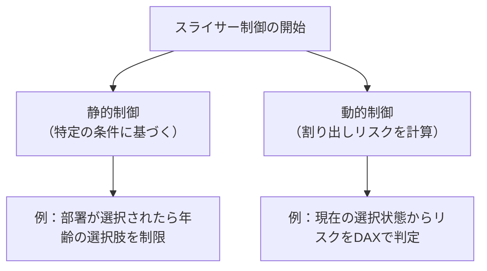

# はじめに

Power BI を使ってアンケート結果や組織データを可視化する際、**特定の条件を組み合わせることで個人が特定されてしまう割り出しリスク**が発生することがあります。本シリーズでは、**スライサーの項目自体を条件に応じて非表示にする**というアプローチを紹介し、Power BI の「ビジュアルフィルター」と「DAX」を活用した実装方法を解説していきます。

---

# 割り出しリスクとは？

アンケートや組織データの分析において、複数の属性（例：部署、年齢、性別など）を組み合わせることで、**特定の個人が推測できてしまう**ことがあります。このシリーズではこのような事象を「割り出し」と呼びます。匿名で取ったアンケートだとしても、社内アンケートのように回答した集団を知っている状況では、プライバシー保護の観点から避けるべき事象と言えます。

---

# 組織データの特徴と割り出しポイントの抽出

組織データには以下のような特徴があり、割り出しリスクを高める要因となります。

## 1. 階層構造

組織は通常、上位から下位へと階層的に構成されています（例：本社 → 部門 → チーム）。**階層が下がるほど所属人数が少なくなり、割り出しのリスクが高まります**。

## 2. 属性の組み合わせ

階層情報に加えて、年齢・性別・勤続年数・職位などの属性を組み合わせることで、**一意に近い条件が生まれやすくなります**。

---

# 代表的な回答者属性とその活用のメリット・デメリット
しかしながら、割り出しにつながる回答者の属性はアンケート結果を分析する上で重要です。
最初からアンケート項目に含めないという判断もありますが、**割り出しリスクを考慮しつつ、属性を活用したい**ケースがあるかと思います。
以下は、代表的な回答者の属性とそのメリット・デメリットをまとめたものです。

| 属性 | メリット | デメリット |
|------------|----------------------------------|----------------------------------------|
| 年齢 | 世代別傾向の把握が可能 | 年齢層が狭いと割り出しリスクが高まる |
| 性別 | 多様性の分析に有効 | 少数派の性別が特定されやすい |
| 部署 | 組織単位での傾向分析が可能 | 小規模部署では個人特定のリスク |
| 勤続年数 | 経験年数による傾向が見える | 特定の年数に偏りがあるとリスク増 |

---

# スライサーの表示制御の基本的な考え方
スライサーの表示制御は、特定の条件に基づいてスライサーの項目を非表示にすることで、割り出しリスクを軽減する手法です。これにより、ユーザーが選択できる項目を制限し、個人が特定されるリスクを低減します。
スライサーの表示制御は、主に以下の2つのアプローチで実現できます。

## 1. 静的な条件に基づく制御

特定のスライサー（例：部署）が選択されたときに、他のスライサー（例：年齢）の項目を制限する方法です。これは比較的シンプルに実装できます。

## 2. 動的な割り出しリスクに基づく制御

現在のスライサーの選択状態をもとに、次に選択可能な項目が「割り出し」につながるかどうかを DAX で判定し、表示を制御する方法です。より柔軟で高度な制御が可能ですが、DAX の設計がやや複雑になります。

---

# 次回予告

次回は、**DAX を使ってスライサーの表示を制御する具体的な方法**を紹介します。まずは静的な条件に基づく制御から始め、実際の DAX 式やビジュアルフィルターの設定方法を詳しく解説していきます。
