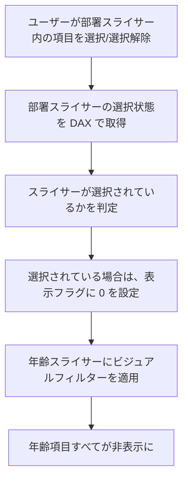
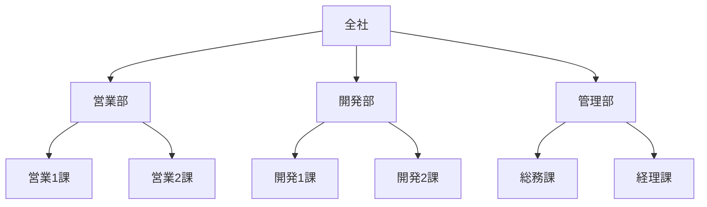
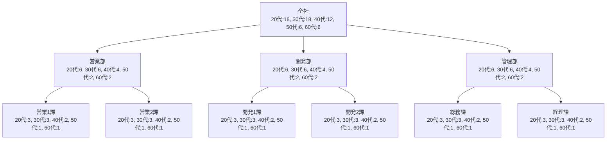

# はじめに

[前回の記事](https://zenn.dev/microsoft/articles/power-bi-slicer-filtering-1)では、スライサー項目の表示制御が必要となる背景や、組織データにおける割り出しリスクについて解説しました。

今回は、**Power BI のビジュアルフィルターと DAX を使って、特定の条件に基づいてスライサー項目を制御する方法**を紹介します。まずは比較的シンプルな「条件」に基づく制御から始めましょう。

---

# シナリオ：部署が選択されたときに年齢の選択肢を制限する

以下のようなスライサー構成を想定します：

- スライサー1：部署（営業部、開発部、管理部）
- スライサー2：年齢（20代、30代、40代、50代、60代）

たとえば、「営業部」が選択されたときに「50代」が1人しかいない場合、年齢スライサーに項目が残っていると、50代の方の回答が割り出すことが可能です。

すべて非表示にしなくてもよいのでは？と思う方もいらっしゃると思います。しかしながら、例えば50代以外の年齢の選択肢を残してしまうと、残っている項目を選択することで結果として **「50代」の人の回答が割り出せてしまう** ため、割り出しリスクを低減するためにすべての項目を非表示にします。

---

# 処理ステップ
まず、処理全体のステップを見て、イメージを掴んでみましょう。



## 1. 年齢スライサーにフィルター判定用の DAX を追加

まず、年齢スライサーの「表示可否」を判定する DAX を追加します。

```DAX
年齢スライサー表示フラグ = 
VAR SelectedFlag = ISFILTERED(部署[部署名])
RETURN
IF(
    SelectedFlag,
    0,
    1
)
```

この DAX は、部署がスライサーのいずれかの項目が選択されたときに 0 を返し、それ以外は 1 を返します。ただし、この時点では、スライサーの項目には特に変化は起こりません。項目を非表示にするためには次のステップでフィルターを設定します。

:::message alert
ここで紹介する DAX は、スライサーの選択状態を判定するためのロジックの一例です。実際の**データモデルやレポートの要件に応じて調整が必要**です。
:::

## 2. 年齢スライサーにビジュアルレベルフィルターを設定
次に、年齢スライサーのビジュアルに対して、先ほど作成した「年齢スライサー表示フラグ」列を使ってフィルターを設定します。

フィルター対象：年齢スライサー表示フラグ
条件：1 である

これにより、営業部が選択されたときに年齢スライサーからすべての項目が除外されます。

---

# 注意点とベストプラクティス
この方法は「スライサーの選択」を条件としているため、事前にリスクのあるスライサーの組み合わせを把握しておく必要があります。
スライサーの順序（どのスライサーを先に選ぶか）によって制御の効果が変わるため、ユーザーの操作順序も考慮しましょう。

## スライサーの組み合わせパターンの把握の例
前述の例はシンプルすぎるので、もう少し複雑なシナリオでパターンを考えてみる練習をしておきたいと思います。この時に役立つのは、「組織」がどのように構成されているかの理解です。
例えば、以下のような組織構成を考えます：



実際に各課には何人が所属しているかを数えてもよいのですが、ここでは仮にすべての課に10人ずつ所属しているとします。乱暴な推定にはなりますが、一人の課長で管理できる人数は10人を大きく超えたり少なくなることはないというのが平均的な状態だと思います。

さて、このように仮定を置くと、人数の合計としては以下のようになります。
- 会社全体：60人
- 各部：20人ずつ
- 各課：10人ずつ

組織のピラミッド構造を下へと降りていくと、人数が減っていくことがわかりますね。
つまり、下位構造になればなるほど、人数が少なくなり、割り出しリスクが高まるということです。
このような組織構造を理解しておくと、スライサーの組み合わせパターンを把握しやすくなります。

では次に、年代を考慮してみたいと思います。
会社という組織における年代別の構成比は、個社ごとに大きく違ってくるため、ここではあくまでも仮定として以下の通りとしてみたいと思います
- 20代：30%
- 30代：30%
- 40代：20%
- 50代：10%
- 60代：10%

この年代比を考慮すると、各部や各課の人数は以下のようになります。



非常に雲行きが怪しくなってきましたね。課の粒度で見るとすべての年代で数名ずつの構成となり、特に人数が少ない年代については簡単に割り出しができてしまいそうです。
この例では、実装例と同様に年代を取り上げましたが、その他の回答者属性も同様に、組織構造を下へと降りた場合に割り出しが容易になりやすいケースがありますので注意が必要です。

# まとめ

本記事では、Power BI のスライサー項目を条件に応じて制御する方法について、背景となるリスクや具体的なDAX実装例、組織構造を踏まえた注意点まで解説しました。

- **なぜスライサー制御が必要か**（割り出しリスクの観点）
- **DAXとビジュアルフィルターを使った実装手順**
- **組織構造や属性によるリスクの変化とその考え方**

これらを理解することで、より安全かつ柔軟なレポート設計が可能になります。  
特に、組織の階層や属性の分布を意識したスライサー制御は、実務での情報漏洩リスク低減に直結します。

---

次回は、**動的に割り出しリスクを判定し、スライサー項目を自動制御する方法**を紹介します。  
DAXを活用して「現在の選択状態から割り出しリスクを計算する」ロジックを構築し、さらに実践的な制御方法を解説します。