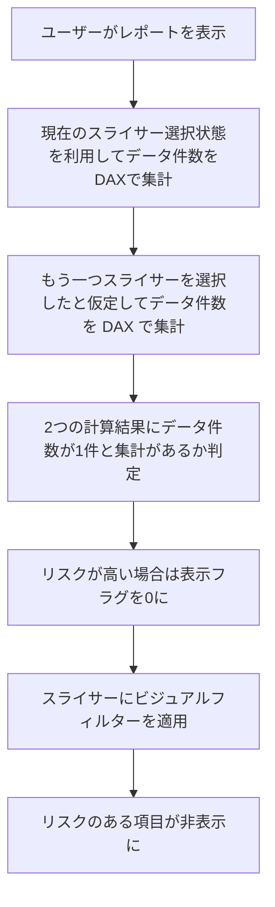

# はじめに

前回の記事（[条件制御編](https://zenn.dev/microsoft/articles/power-bi-slicer-filtering-2)）では、スライサーの選択状態に応じて項目を制御する基本的な方法を紹介しました。今回はさらに一歩進めて、**現在のスライサー選択状態から割り出しリスクを動的に判定し、スライサー項目を制御する方法**を解説します。

---

# シナリオ：部署が選択されたときに年齢の選択肢を制限する

今回も、前回と同様のデータを対象として考えていきます。
アンケートや組織データを分析する際に、以下のようなスライサー構成を想定します：

- スライサー1：部署（営業部、開発部、管理部）
- スライサー2：年齢（20代、30代、40代、50代、60代）

たとえば、「営業部」が選択されたときに「50代」が1人しかいない場合、年齢スライサーに項目が残っていると、50代の方の回答が割り出すことが可能です。

すべて非表示にしなくてもよいのでは？と思う方もいらっしゃると思います。しかしながら、例えば50代以外の年齢の選択肢を残してしまうと、残っている項目を選択することで結果として **「50代」の人の回答が割り出せてしまう** ため、割り出しリスクを低減するためにすべての項目を非表示にします。

条件制御との違いは、**スライサーの選択状態に応じて動的にリスクを計算して評価**する点です。

---

# 処理フロー
まず、処理全体のステップを見て、イメージを掴んでみましょう。
条件制御よりもやや複雑になっています。複雑な理由は、一つ先のスライサー選択を考慮するフローとしているからです。



## 1. 年齢スライサーにフィルター判定用の DAX を追加

まず、現在のスライサー選択状態で該当する件数をカウントし、**閾値（例：5人未満）**を下回る場合にリスクフラグを立てるDAXを作成します。

```DAX
割り出しリスクフラグ =
VAR 件数 = CALCULATE(COUNTROWS(対象テーブル), ALLSELECTED(対象テーブル))
VAR 閾値 = 5
RETURN IF(件数 < 閾値, 0, 1)
```

このDAXは、スライサーで絞り込まれた状態で件数をカウントし、閾値未満なら0（リスクあり）、それ以外は1（リスクなし）を返します。

---

## 2. スライサーにビジュアルレベルフィルターを設定

作成した「割り出しリスクフラグ」列をスライサーのビジュアルレベルフィルターに追加し、「1」の場合のみ表示されるように設定します。

- フィルター対象：割り出しリスクフラグ
- 条件：1

これにより、リスクが高い（該当件数が少ない）場合は自動的にスライサー項目が非表示になります。

---

# 注意点とベストプラクティス

- **閾値の設定**は、組織のポリシーやデータの性質に応じて調整してください。
- **ALLSELECTED**の使い方や、複数スライサーの組み合わせによる影響も考慮しましょう。
- 実際のデータモデルや要件に合わせてDAXを調整することが重要です。

---

# まとめ

本記事では、Power BIでスライサーの選択状態から割り出しリスクを動的に判定し、リスクが高い場合に自動で項目を非表示にする方法を紹介しました。  
このアプローチにより、より柔軟かつ安全なレポート運用が可能になります。

次回は、さらに複雑な条件や複数属性の組み合わせによるリスク判定の自動化について解説します。お楽しみに！
