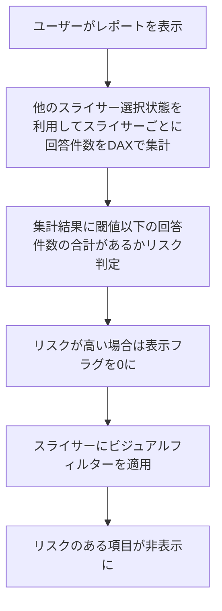
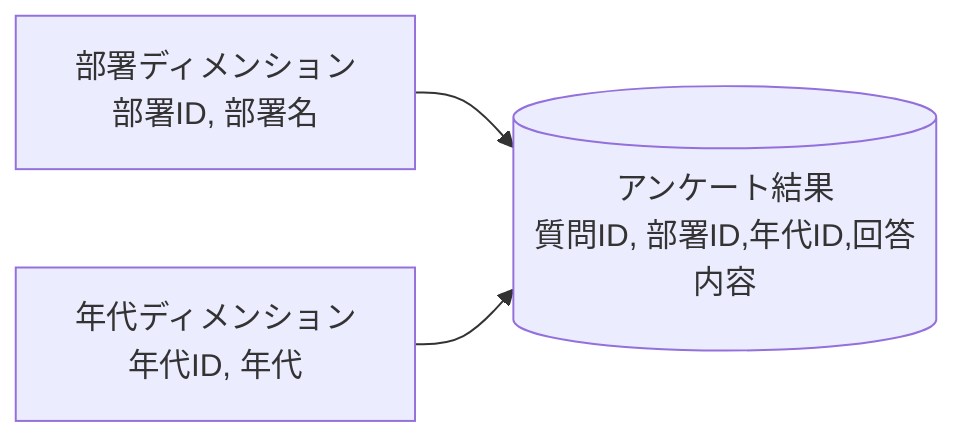

# はじめに

前回の記事（[条件制御編](https://zenn.dev/microsoft/articles/power-bi-slicer-filtering-2)）では、スライサーの選択状態に応じて項目を制御する基本的な方法を紹介しました。今回はさらに一歩進めて、**現在のスライサー選択状態から割り出しリスクを動的に判定し、スライサー項目を制御する方法**を解説します。

---

# シナリオ：部署が選択されたときに年代の選択肢を制限する

今回も、前回と同様のデータを対象として考えていきます。
アンケートや組織データを分析する際に、以下のようなスライサー構成を想定します：

- スライサー1：部署（営業部、開発部、管理部）
- スライサー2：年代（20代、30代、40代、50代、60代）

例として、「営業部」を選択した結果「50代」が1人しかいない場合、スライサーにその年代項目が残っていると、50代の方の回答が割り出される恐れがあります。

それなら、「必要最小限のスライサー項目を**非表示**にすればよいのでは？」と思う方もいらっしゃると思います。しかし、例えば50代以外の年代の選択肢を残してしまうと、残っている項目を選択することで **「50代」の人の回答が割り出せてしまいます。** このような選ばないことによる割り出しリスクも同時に低減するため、すべてのスライサー項目を同時に非表示にします。

条件制御との違いは、**スライサーの選択状態に応じて動的にリスクを計算して評価**する点です。結果として、条件制御よりも多くスライサーを使用できる可能性が出てきます。

---

# 処理フロー
まず、処理全体のステップを見て、イメージを掴んでみましょう。
条件制御よりもやや複雑になっています。複雑な理由は、一つ先のスライサー選択を考慮するフローとしているからです。



## データモデルの設例
データモデルはここに整理しておきたいと思います。基本的なスタースキーマだと理解してもらえればと思います。



## 1. 年代スライサーにフィルター判定用の DAX を追加

まず、現在のスライサー選択状態で該当する回答件数をカウントし、**閾値（例：5人未満）** を下回る場合にリスクフラグを立てるDAXを作成します。この時、スライサー内の項目が残ってしまうと割り出しのリスクが残ってしまうため、一つでも閾値に該当する条件の項目がある場合、スライサー内の項目を全部非表示にします。

```DAX
年代リスクフラグ =
VAR 閾値 = 5
VAR 年代別件数テーブル =
    ADDCOLUMNS(
        ALL(年代ディメンション[年代ID]),
        "人数",
            CALCULATE(
                COUNTROWS(アンケート結果),
                ALLSELECTED(部署ディメンション)
            )
    )
VAR 最小人数 =
    MINX(
        年代別件数テーブル,
        COALESCE([人数], 0)
    )
VAR リスク有 = 最小人数 < 閾値
RETURN IF(リスク有, 0, 1)
```

このDAXは、年代スライサー以外のスライサーで絞り込まれた状態で、年代別に回答件数をカウントし、最小の回答件数が閾値未満なら0（リスクあり）、それ以外は1（リスクなし）を返します。
閾値は例のようにハードコーディングするのも一つの案ですが、各所で再利用することが想定されるので、パラメーターのような再利用できる形で定義する方が便利かもしれません。

---

## 2. スライサーにビジュアルレベルフィルターを設定

作成した「年代リスクフラグ」列をスライサーのビジュアルレベルフィルターに追加し、「1」の場合のみ表示されるように設定します。

- フィルター対象：年代リスクフラグ
- 条件：1

これにより、リスクが高い（該当件数が少ない）場合は自動的にスライサー項目がすべて非表示になります。

---

# 考慮事項

- **DAX によるデータ開示の制御は限定的**です。柔軟さを切り捨ててシンプルな制限に落とし込む(スライサーは一括で項目が見えなくなる)ことで実現しようとしています。柔軟なデータ開示が必要な場合は別の方法を検討した方がよいです。
- **閾値の設定**は、組織のポリシーやデータの性質に応じて調整してください。この値にすれば安全ということを保障したいのであれば、できるだけ大きな値を採用することになると思います。ただし、データの絞り込みができない状態も増えるので、データ活用とのトレードオフです。
- 実際の **データモデルや要件に合わせて** DAXを調整することが重要です。

---

# まとめ

本記事では、Power BIでスライサーの選択状態から割り出しリスクを動的に判定し、リスクが高い場合に自動で項目を非表示にする方法を紹介しました。  
このアプローチにより、より柔軟かつ安全なレポート運用が可能になります。ただし実装できる柔軟さには限界があるのでその点を踏まえて利用するのがよいでしょう。